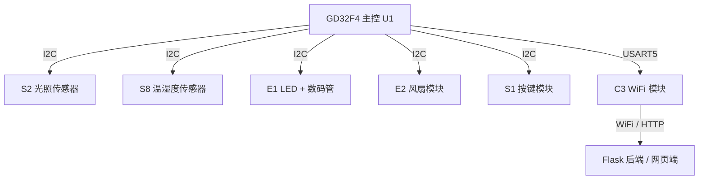
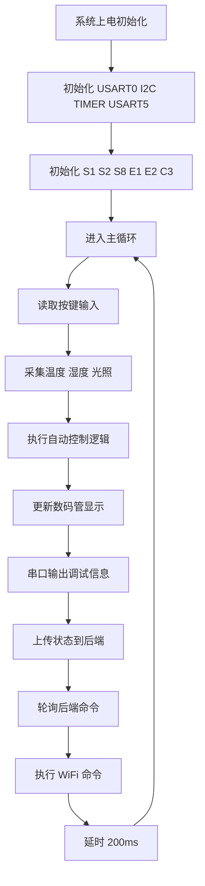
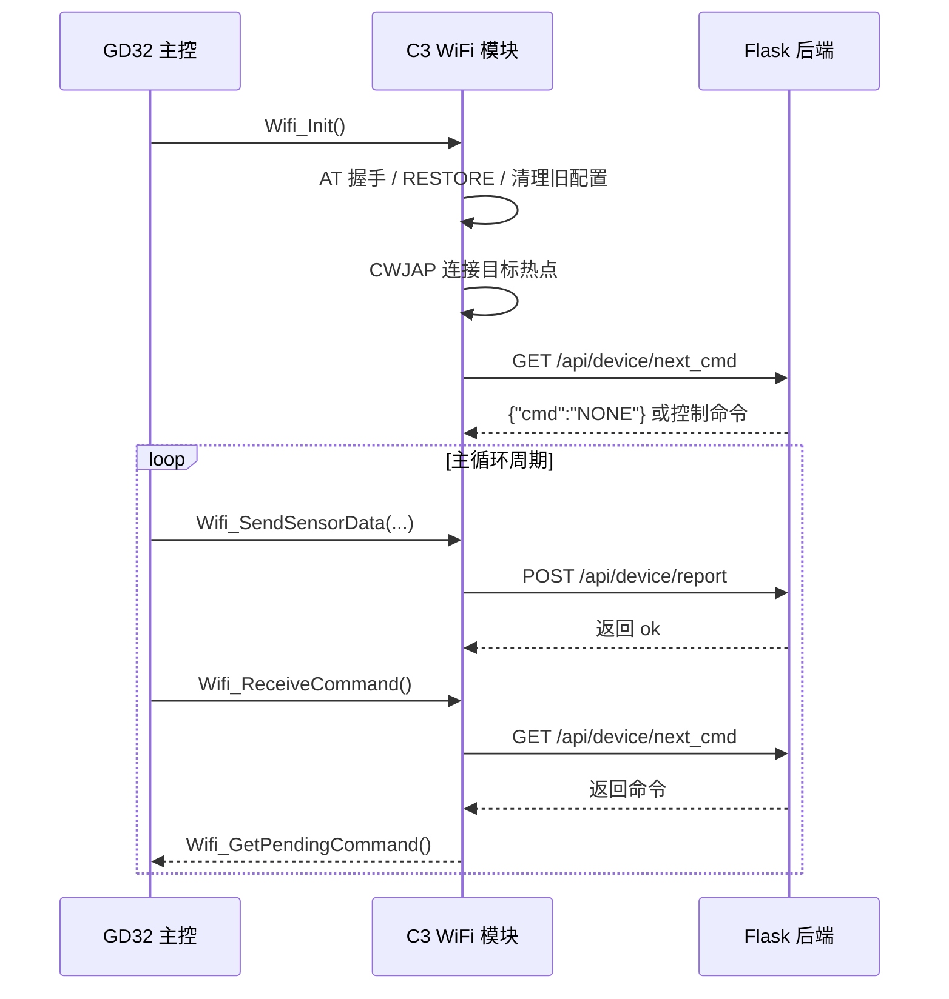

物联网智能终端

综合课程设计

项目总结报告

项目名称： *基于GD32F4微控制器的智能家居环境监测与控制系统*

成员(工作占比)：欧祖宇 30%，完成大体代码结构和调试

成员(工作占比)：徐凯哲 20%，参与代码完善和调试

成员(工作占比)：张习羽 20%，负责项目PPT制作和文件资料整合

成员(工作占比)：孙伟哲 15%，协助完成PPT并且负责演讲展示ppt，组件的拼装

成员(工作占比)：华帅杰 15%，协助资料搜集和组件拼装

班级：15班

日期：

**  **

## 一、项目背景及研究内容

随着物联网技术、嵌入式控制技术以及智能家居产业的快速发展，家庭环境监测与自动化控制已经成为物联网应用中的重要方向。传统家居设备通常依赖人工开关控制，缺少对环境变化的实时感知能力，也难以实现远程监控与智能联动。为了提高家庭环境管理的自动化程度，本项目设计并实现了一套基于GD32F4微控制器的智能家居环境监测与控制系统。

本项目以GD32F4xx系列微控制器作为主控核心，结合温湿度传感器、光照传感器、LED、风扇、数码管显示模块、按键模块以及WiFi通信模块，实现对室内环境数据的实时采集、本地显示、自动控制、手动控制和无线通信功能。系统能够读取当前环境温度、湿度和光照强度，并根据预设阈值自动控制照明和风扇运行；同时用户也可以通过按键或WiFi指令切换控制模式，实现对LED和风扇的远程控制（目前wifi功能暂未调试完毕）。

本项目主要研究内容包括以下几个方面：

1. **多传感器数据采集**  
   系统通过I2C总线连接光照传感器和温湿度传感器，周期性采集环境光照、温度和湿度数据，并对异常数据进行限幅处理，保证系统运行的稳定性。

2. **智能设备自动控制**  
   在自动模式下，系统根据光照强度判断是否开启LED照明，根据温度高低分级调节风扇占空比，实现环境调节功能。

3. **手动控制与本地交互**  
   系统通过按键模块实现模式切换、LED开关控制和风扇开关控制，并通过数码管显示当前温度和光照信息，提高系统的人机交互能力。

4. **WiFi通信扩展**  
   在原有本地控制功能的基础上，本项目尝试增加WiFi通信与网页端远程交互功能。项目过程中完成了网页端的基本搭建，并实现了网页端与系统通信链路的初步连接，为后续实现远程监控与控制提供了基础。系统程序中设计了WiFi数据上报与远程指令接收接口，计划通过WiFi模块将温度、湿度、光照、风扇状态、LED状态和当前工作模式等数据上传到网页端，同时网页端可以下发控制指令，实现对LED、风扇和系统模式的远程控制。但在实际调试过程中，虽然网站已经搭建完成并能够建立连接，WiFi通信部分在远程指令发送和数据包接收解析方面仍存在问题，导致网页端下发的控制指令不能稳定、准确地被单片机接收和执行，传感器数据包的接收与解析也没有完全调通。因此，WiFi远程控制功能目前处于初步实现和联调阶段，尚未达到稳定可用状态。

## 二、主要相关技术介绍

### 1.GD32F4微控制器技术

本系统采用GD32F4xx系列 ARM Cortex-M4微控制器作为主控芯片。该芯片具有较高的主频、丰富的外设资源和较强的实时控制能力，适合应用于智能终端、工业控制和物联网设备中。

在本项目中，主要使用了GD32F4的GPIO、USART、I2C、TIMER和NVIC中断控制等外设。其中GPIO用于LED指示和外设接口配置；I2C总线用于连接传感器和执行器模块；TIMER3用于实现毫秒级延时，为系统周期性任务提供基础。

### 2.I2C总线通信技术

I2C是一种常用的串行总线通信协议，具有连线少、支持多主多从、硬件资源占用低等特点。本项目中的S1按键模块、S2光照模块、S8温湿度模块、E1显示与LED模块以及E2风扇模块均通过I2C总线进行通信。

系统在初始化阶段分别配置I2C0和I2C1，并对各个模块地址进行初始化。通过统一的地址结构体保存外设地址、总线号和有效标志，在主程序中可以根据模块是否存在决定是否执行读写操作。这种设计增强了系统的兼容性和可靠性，也便于后续增加新的I2C设备。

### 3.传感器数据采集技术

系统使用S2光照传感器读取当前环境光照强度，使用S8温湿度传感器读取环境温度和相对湿度。读取到的数据被保存在`SmartHomeState`状态结构体中，作为自动控制、显示输出和WiFi上报的数据来源。

为了防止异常数据影响系统运行，程序中对温度和湿度进行了范围限制。例如温度被限制在-40℃到125℃之间，湿度被限制在0%RH 到100%RH之间。这样的处理可以避免传感器通信异常或瞬时干扰导致控制逻辑误动作。

### 4.PWM与执行器控制技术

系统中的LED和风扇模块通过执行器驱动函数进行控制。LED可设置为全亮或关闭状态，风扇支持开关控制和占空比控制。项目中用`smart_home_fan_set_duty()`函数设置风扇占空比，并根据占空比判断风扇是否处于开启状态。

与简单的开关控制相比，占空比控制可以实现更加灵活的风扇调速。在自动模式下，系统根据温度分为多个等级，当温度达到不同阈值时设置不同的风扇占空比，从而实现分级散热控制。

### 5.WiFi通信技术

本项目在原有本地控制功能基础上加入了WiFi通信模块，并尝试结合网页端实现远程监测与控制。程序中通过uart_init(USART5)初始化WiFi模块所使用的串口，并调用Wifi_Init()完成WiFi模块的初始化配置。

在软件设计中，系统预留并调用了Wifi_SendSensorData()、Wifi_ReceiveCommand()和Wifi_GetPendingCommand()等函数。其中，Wifi_SendSensorData()用于向网页端或服务器发送当前温度、湿度、光照、LED状态、风扇状态和系统模式等数据；Wifi_ReceiveCommand()用于接收网页端下发的控制数据；Wifi_GetPendingCommand()用于获取待处理的控制命令。

网页端方面，本项目已经完成了基本页面搭建，并实现了与设备端通信链路的初步连接。但是在实际联调过程中，网页端指令发送、WiFi模块数据转发以及单片机端数据包接收解析之间仍存在不稳定问题。具体表现为：指令无法被单片机正确识别，数据包接收不完整或解析失败，导致远程控制功能未能稳定实现。因此，WiFi通信部分目前完成了框架设计、网站搭建和连接测试，但指令下发与数据接收功能仍需进一步调试和完善。

#### WiFi模块初始化核心代码

为了更具体地体现WiFi通信技术在本系统中的实现方式，下面摘录了ESP32 模块初始化、旧热点配置清理以及目标热点连接的关键代码。该部分代码说明系统并非仅停留在接口预留层面，而是已经完成了串口AT控制、热点连接和通信前准备等基础实现。

```c
static void c3_restore_module_config_once(void)
{
#if C3_WIFI_FORCE_RESTORE_ON_BOOT
    if (g_restore_done != 0U) {
        return;
    }

    g_restore_done = 1U;
    debug_printf(USART0, "C3 RESTORE CONFIG\r\n");

    c3_uart_flush_rx();
    c3_uart_send_text("AT+RESTORE\r\n");
    c3_uart_read_response(g_resp_buffer, (uint16_t)sizeof(g_resp_buffer), C3_WIFI_RESTORE_TIMEOUT_MS);
    c3_log_resp("C3 RESTORE RESP: ");

    c3_wait_ms(C3_WIFI_POST_RESTORE_WAIT_MS);
    c3_uart_flush_rx();
    (void)c3_wait_at_ready();
#endif
}

static void c3_clear_previous_wifi(void)
{
    (void)c3_send_at_expect("AT+CWAUTOCONN=0\r\n", "OK", 1000U);
    (void)c3_send_at_expect("AT+CWRECONNCFG=0,0\r\n", "OK", 1000U);
    (void)c3_send_at_expect("AT+CWQAP\r\n", "OK", C3_WIFI_LEAVE_TIMEOUT_MS);
    (void)c3_send_at_expect("AT+SYSSTORE=0\r\n", "OK", 1000U);
}
```

## 三、需求分析

本系统需要完成环境数据采集、设备控制、本地显示、串口调试和WiFi通信等功能，具体需求如下：

### 1.环境监测需求

系统应能够实时读取室内温度、湿度和光照强度。其中温度单位为摄氏度，湿度单位为相对湿度百分比，光照数据用于判断当前环境明暗程度。采集数据应具有一定稳定性，并在出现异常值时进行合理处理。

### 2.自动控制需求

系统应支持自动工作模式。在自动模式下，程序根据传感器数据执行控制逻辑：

- 当光照强度低于设定阈值时，自动开启LED照明；

- 当光照强度高于设定阈值时，关闭LED；

- 当温度达到不同设定等级时，风扇以不同占空比运行；

- 当温度低于最低风扇启动阈值时，关闭风扇。

相比单一阈值控制，分级风扇控制更加符合实际应用需求，能够根据环境温度变化逐步调节风扇转速。

### 3.手动控制需求

系统应支持手动工作模式，用户可以通过按键直接控制LED和风扇状态。根据程序设计，按键SW1用于自动模式和手动模式切换，SW2用于手动模式下切换LED开关状态，SW3用于手动模式下切换风扇开关状态。

### 4.本地显示需求

系统应具备本地显示功能，通过数码管显示当前环境信息。程序中将温度和光照数据组合显示：前两位显示温度整数部分，后两位显示光照强度经过比例处理后的数值，便于用户快速观察环境状态。

### 5.WiFi远程通信需求

系统设计目标中包含WiFi远程通信功能，要求设备能够通过WiFi模块与网页端建立连接，实现环境数据上传和远程控制指令下发。具体目标包括：将温度、湿度、光照强度、LED状态、风扇状态和系统工作模式上传至网页端；网页端能够向设备发送LED开关、风扇开关、自动模式切换、手动模式切换和状态读取等控制指令。

## 四、概要设计

### 1.硬件模块设计

为便于直观展示本项目的硬件组成关系，可将系统硬件架构总结为如下图所示。该图体现了GD32F4 主控与各I2C 子模块、WiFi 模块以及电脑端后端服务之间的连接关系。



本系统主要由以下硬件模块组成：

1. **主控模块**  
   采用GD32F4xx微控制器，负责系统初始化、数据采集、控制决策、外设通信和任务调度。

2. **传感器模块**  
   包括S2光照传感器模块和S8温湿度传感器模块，分别用于采集环境光照强度、温度和湿度数据。

3. **执行器模块**  
   包括E1 LED 模块和E2风扇模块。LED用于模拟照明设备，风扇用于模拟环境散热或通风设备。

4. **显示与按键模块**  
   E1显示模块用于数码管数据显示，S1按键模块用于用户本地输入。

5. **WiFi通信模块**  
   WiFi模块通过USART5与主控芯片进行串口通信，主要用于实现设备端与网页端之间的数据交互。网页端已经完成基本搭建，并与设备端进行了连接测试。系统设计上计划通过WiFi模块上传传感器数据，并接收网页端下发的控制指令。但在实际调试中，指令发送和数据包接收解析存在问题，远程控制功能尚未完全实现。

### 2.软件结构设计

为了说明软件各模块之间的层次关系，可将系统程序划分为底层驱动层、模块驱动层和应用控制层三部分：底层驱动层负责GPIO、I2C、USART 和定时器配置；模块驱动层负责S1、S2、S8、E1、E2 与C3 的功能封装；应用控制层集中在`main.c`，负责状态维护、自动控制、手动控制以及WiFi通信调度。这样的分层方式有利于后续对功能进行扩展和维护。

系统软件采用分层设计思想，主要分为底层驱动层、设备控制层和应用逻辑层。

1. **底层驱动层**  
   包括GPIO、I2C、USART、TIMER等基础外设驱动，负责为上层模块提供硬件访问接口。

2. **模块驱动层**  
   包括S1、S2、S8、E1、E2和WiFi模块驱动。各模块通过独立函数完成初始化、数据读取和设备控制，使主程序结构更加清晰。WiFi模块通过USART5与主控芯片进行串口通信，主要用于实现设备端与网页端之间的数据交互。

3. **应用逻辑层**  
   主要集中在`main.c`中。系统定义了`SmartHomeState`状态结构体，用于统一保存温度、湿度、光照、LED状态、风扇状态、风扇占空比和当前工作模式。应用层根据该状态结构体进行数据显示、自动控制、串口输出和WiFi通信。

#### 核心状态结构体代码摘录

下面代码展示了系统在应用层中定义的核心状态结构体以及本地控制封装函数。通过统一的状态对象保存环境数据和设备状态，可以有效降低程序逻辑复杂度，便于后续功能扩展。

```c
typedef enum {
    MODE_AUTO = 0,
    MODE_MANUAL = 1
} SystemMode;

typedef struct {
    float temperature;
    float humidity;
    uint16_t light;
    uint8_t led_on;
    uint8_t fan_on;
    uint8_t fan_duty;
    SystemMode mode;
} SmartHomeState;

static SmartHomeState state = {0};

static void smart_home_led_set(uint8_t on)
{
    state.led_on = on ? 1U : 0U;
    if (e1_led_addr.flag) {
        if (state.led_on) {
            e1_rgb_control(e1_led_addr.periph, e1_led_addr.addr, 255, 255, 255);
        } else {
            e1_rgb_control(e1_led_addr.periph, e1_led_addr.addr, 0, 0, 0);
        }
    }
}
```

### 3.系统运行流程

系统的软件运行流程可概括为初始化、传感器采集、自动控制、显示更新、串口调试输出、WiFi上报与命令轮询几个阶段。对应流程如图所示。



系统启动后，首先设置NVIC中断优先级，然后初始化USART0、GPIO、I2C0、I2C1、各传感器模块、执行器模块、TIMER3和WiFi模块。初始化完成后，系统默认进入自动模式，并设置初始温度、湿度、光照、LED和风扇状态。

主循环中，系统按固定周期执行以下任务：

1. 读取按键值，并根据按键执行模式切换或手动控制；

2. 读取光照、温度和湿度数据；

3. 在自动模式下执行LED和风扇控制逻辑；

4. 更新数码管显示内容；

5. 通过USART0输出调试信息；

6. 调用WiFi数据发送函数，尝试将传感器数据和设备状态上传至网页端；

7. 调用WiFi指令接收函数，尝试接收网页端下发的控制命令；

8. 若成功解析到有效指令，则根据指令调整LED、风扇或工作模式；

9. 目前在实际调试中，网页端已搭建并能够建立连接，但远程指令发送和设备端数据包接收解析仍存在问题，因此WiFi远程控制流程尚未完全稳定实现。

## 五、达成的功能和效果

经过程序设计与调试，本项目基本完成了智能家居环境监测与控制系统的主要功能，具体如下：

### 1.环境数据采集功能

系统能够正常通过S8模块读取温度和湿度，通过S2模块读取光照强度。采集到的数据会被保存到系统状态结构体中，并用于显示、控制和WiFi上报。对于异常温湿度数据，程序进行了限幅处理，提高了系统的稳定性。

### 2.自动控制功能

为了更清晰地说明自动控制功能的实现方式，下面给出自动模式下的核心控制代码。程序根据当前光照值决定LED是否点亮，根据当前温度分级设置风扇占空比，完成室内环境的自适应调节。

```c
static void smart_home_apply_auto_control(void)
{
    uint8_t duty = 0U;

    if (state.mode != MODE_AUTO) {
        return;
    }

    smart_home_led_set(state.light < LIGHT_THRESHOLD);

    if (state.temperature >= FAN_TEMP_LEVEL_4) {
        duty = FAN_DUTY_LEVEL_4;
    } else if (state.temperature >= FAN_TEMP_LEVEL_3) {
        duty = FAN_DUTY_LEVEL_3;
    } else if (state.temperature >= FAN_TEMP_LEVEL_2) {
        duty = FAN_DUTY_LEVEL_2;
    } else if (state.temperature >= FAN_TEMP_LEVEL_1) {
        duty = FAN_DUTY_LEVEL_1;
    }

    smart_home_fan_set_duty(duty);
}
```

系统默认工作在自动模式。在该模式下，程序会根据光照强度自动控制LED。当光照值低于设定阈值时，LED自动点亮；当光照充足时，LED自动关闭。

同时，系统根据温度变化对风扇进行分级控制。当温度达到不同温度等级时，风扇占空比会相应提高；当温度较低时，风扇关闭。该设计比简单的开关控制更加灵活，能够更好地模拟实际智能家居中的温控策略。

### 3.手动控制功能

系统支持按键手动控制。按下SW1可在自动模式与手动模式之间切换；在手动模式下，按下SW2可以切换LED开关状态，按下SW3可以切换风扇开关状态。通过该功能，用户可以在自动控制之外直接干预设备运行状态。

### 4.本地显示功能

数码管能够显示经过处理后的温度和光照数据。程序将温度限制在0到99范围内，将光照值除以100后限制在0到99范围内，并组合成四位数进行显示。该显示方式简单直观，能够满足基本本地查看需求。

### 5.串口调试功能

系统通过USART0以115200波特率输出运行状态信息，包括当前模式、温度、湿度、光照、LED状态、风扇状态和风扇占空比。例如输出内容中包含`AUTO`或`MANUAL`模式标识，便于在调试过程中观察系统运行逻辑是否正确。

### 6.WiFi数据上报与远程控制功能

为了说明WiFi远程控制功能目前已经完成到何种程度，下面给出后端接口和命令队列的关键实现代码。可以看出，电脑端已经完成了设备状态上报、命令轮询和网页端下发命令的基础框架，但当前实物联调仍主要受限于指令发送和数据包接收解析的稳定性问题。

```python
DEFAULT_DEVICE_ID = "smart-home-001"
ALLOWED_COMMANDS = {
    "LED_ON",
    "LED_OFF",
    "FAN_ON",
    "FAN_OFF",
    "AUTO_MODE",
    "MANUAL_MODE",
    "READ_STATUS",
}

_data_lock = Lock()
_latest_status = {}
_command_queue = deque()

@app.route("/api/device/report", methods=["POST"])
def device_report():
    payload = request.get_json(silent=True) or {}
    device_id = _normalize_device_id(payload.get("device_id"))

    status = _default_status(device_id)
    for key in ("temperature", "humidity", "light", "fan", "led", "mode"):
        if key in payload:
            status[key] = payload[key]
    status["updated_at"] = _now_text()

    with _data_lock:
        _latest_status[device_id] = status

    return jsonify({"ok": True, "device_id": device_id, "saved_at": status["updated_at"]})

@app.route("/api/device/next_cmd", methods=["GET"])
def device_next_cmd():
    device_id = _normalize_device_id(request.args.get("device_id"))
    next_command = "NONE"

    with _data_lock:
        for index, item in enumerate(_command_queue):
            target = item.get("device_id")
            if target is None or target == device_id:
                next_command = item["cmd"]
                del _command_queue[index]
                break

    return jsonify({"cmd": next_command})
```

同时，系统的WiFi通信过程可以概括为如下时序：GD32主控完成WiFi模块初始化后，C3通过HTTP向Flask后端发送状态数据并轮询控制命令，后端返回命令后再由主控执行对应控制逻辑。



本项目在原有本地智能家居控制功能基础上，增加了WiFi通信和网页端远程控制设计。程序中已经加入了WiFi初始化、传感器数据发送、远程指令接收和命令处理等相关代码逻辑。主程序通过USART5与WiFi模块通信，并在循环中调用Wifi_SendSensorData()上传当前温度、湿度、光照值、风扇状态、LED状态和系统工作模式等信息。

网页端方面，本项目已经完成了基本网站页面的搭建，并进行了设备端与网页端之间的连接测试。从整体设计上看，系统已经具备了向物联网终端方向扩展的基础框架。

但是，在实际联调过程中，WiFi通信部分没有完全达到预期效果。虽然网站已经搭建完成，也能够与设备端建立连接，但网页端控制指令的发送和单片机端数据包的接收仍存在问题。具体表现为：下发的控制指令不能稳定传输到单片机，单片机端对接收到的数据包解析不够准确，数据可能出现接收不完整或无法识别的情况。因此，LED远程开关、风扇远程控制、模式远程切换等功能最终未能稳定实现。

综上，WiFi 部分目前完成了网站搭建、通信接口设计和基础连接测试，但指令发送、数据包接收与解析功能仍未完全调通，属于本项目后续需要重点完善的部分。

## 六、知识应用及经验总结

通过本次综合课程设计，我们对嵌入式系统开发和物联网终端设计有了更加完整的理解。项目不仅涉及传感器数据采集和执行器控制，还涉及通信协议、状态管理和控制逻辑设计。

首先，在I2C总线使用方面，项目加深了对多从设备通信方式的理解。不同模块虽然都挂载在I2C总线上，但设备地址、读写流程和数据格式各不相同，因此需要对每个模块进行独立封装，并在主程序中统一调用。

其次，在软件结构设计方面，项目采用了状态结构体`SmartHomeState`对系统运行状态进行统一管理。这种设计使温度、湿度、光照、LED、风扇和模式等数据集中存储，避免了程序逻辑混乱，也方便WiFi上报和调试输出。

再次，在通信功能扩展方面，项目尝试将本地智能家居控制系统扩展为带有网页端交互能力的物联网终端。我们在程序中加入了WiFi初始化、数据上报和远程指令处理相关接口，并完成了网页端的基本搭建。通过本次尝试，我们对单片机串口通信、WiFi模块数据转发、网页端与设备端交互流程有了更直观的认识。

不过，在WiFi联调过程中也暴露出一些问题。虽然网页端已经搭建完成，并且能够与设备端建立连接，但远程指令发送和数据包接收解析并没有完全成功。造成该问题的可能原因包括：网页端发送的数据格式与单片机端解析格式不完全一致，WiFi模块转发过程中数据包存在粘包或丢包情况，串口接收缓冲区处理不完善，以及通信协议缺少固定帧头、帧尾和校验机制等。

通过这部分调试，我们认识到，物联网通信不仅需要完成硬件连接和网页界面搭建，还需要设计稳定可靠的通信协议。例如后续可以为每条指令增加固定格式，如帧头、命令字、数据长度、校验位和帧尾；同时改进单片机端串口接收缓冲区，避免数据包接收不完整或解析错误。这样才能提高远程控制指令识别的准确性和系统通信的稳定性。

总体而言，本项目完成了智能家居环境监测与控制系统的基本设计目标，实现了环境采集、本地显示、自动控制、手动控制和串口调试等功能。WiFi部分完成了网站搭建、设备连接和程序框架设计，但由于指令发送与数据包接收存在问题，远程控制和稳定数据通信功能尚未最终实现。后续可以继续完善WiFi通信协议、优化数据包解析方式，并增加云平台接入、历史数据存储、异常报警和手机端控制等功能，使系统更加接近实际智能家居产品的应用场景。
